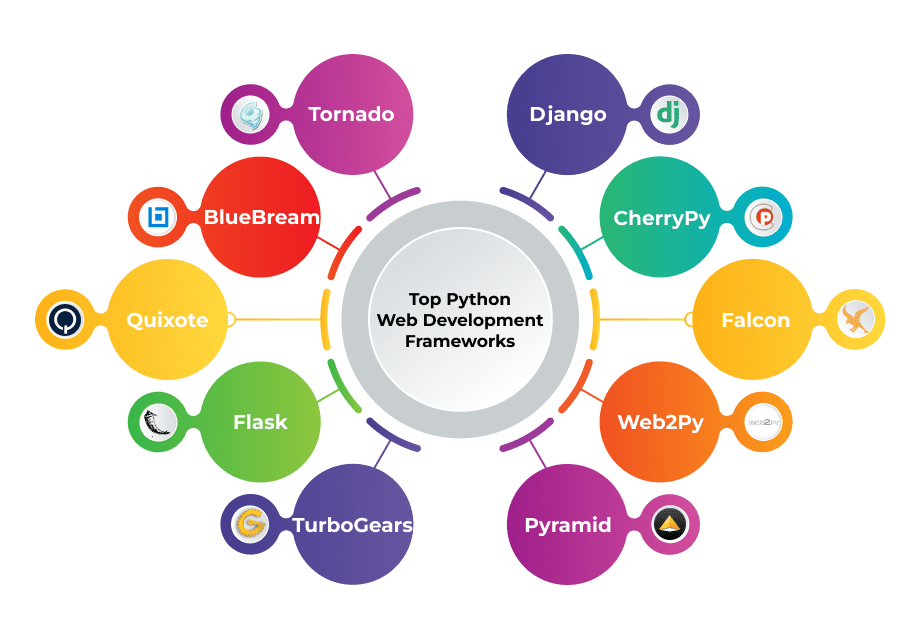

# MODULO 07: FRAMEWORKS E BIBLIOTECAS DO PYTHON

  

## DESCRIÇÃO:
- Este é o **Módulo 07** do curso, onde vamos abordar uma abordagem um pouco diferente em comparação aos módulos anteriores. Aqui, vamos criar um único bot de [RECADOS](https://github.com/VILHALVA/BOT-DE-RECADOS) e convertê-lo para diferentes frameworks do Python:

- [Tkinter](https://github.com/VILHALVA/CURSO-DE-TKINTER)
- [Custom Tkinter](https://github.com/VILHALVA/CURSO-DE-CUSTOMTKINTER)
- [PyQt](https://github.com/VILHALVA/CURSO-DE-PYQT)
- [PySide](https://github.com/VILHALVA/CURSO-DE-PYSIDE)
- [wxPython](https://github.com/VILHALVA/CURSO-DE-WXPYTHON)
- [Flask](https://github.com/VILHALVA/CURSO-DE-FLASK)
- [Django](https://github.com/VILHALVA/CURSO-DE-DJANGO)
- [Pyscript](https://github.com/VILHALVA/CURSO-DE-PYSCRIPT)
- [Kivy](https://github.com/VILHALVA/CURSO-DE-KIVY)
- [BeeWare](https://github.com/VILHALVA/CURSO-DE-BEEWARE)

- Estes bots oferecem uma interface gráfica simples e intuitiva para os usuários enviarem mensagens ou mídias para grupos ou canais no Telegram de forma rápida e eficiente.

## AGORA É A SUA VEZ!
- Este projeto não terá um projeto final definido. Em vez disso, você terá a oportunidade emocionante de adaptar um bot de Telegram inicial para diferentes frameworks e bibliotecas. Isso significa que você receberá um código inicial e terá o desafio de fazer os ajustes necessários para torná-lo funcional em diferentes ambientes de desenvolvimento. É a sua vez de se tornar um desenvolvedor e explorar diferentes abordagens para construir e integrar um bot de Telegram.

### OBJETIVO:
O objetivo deste projeto é fornecer uma oportunidade de aprender e praticar a adaptação de código entre diferentes frameworks e bibliotecas. Ao trabalhar neste projeto, você terá a chance de:

- Aprender sobre diferentes frameworks e bibliotecas para desenvolvimento de bots de Telegram.
- Ganhar experiência prática em adaptar código para diferentes ambientes de desenvolvimento.
- Desenvolver habilidades de resolução de problemas e pensamento crítico ao lidar com desafios de integração.

### COMO TERMINAR?
Você receberá um código inicial que implementa um bot de Telegram usando uma estrutura ou biblioteca específica. Sua tarefa será fazer os ajustes necessários para torná-lo compatível com outra estrutura ou biblioteca de sua escolha. Você pode ser solicitado a ajustar rotas, implementar manipuladores de eventos, lidar com a autenticação ou realizar outras modificações conforme necessário para garantir que o bot funcione corretamente no novo ambiente.