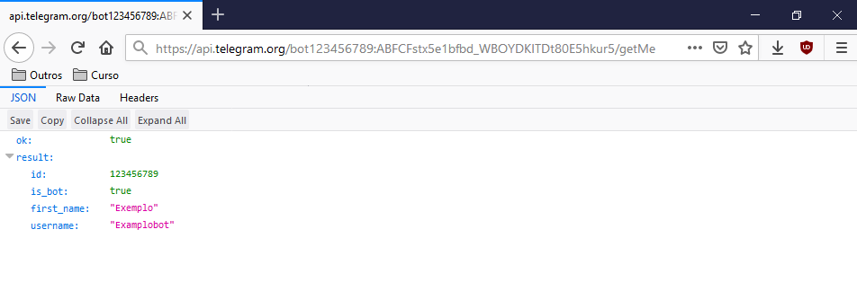
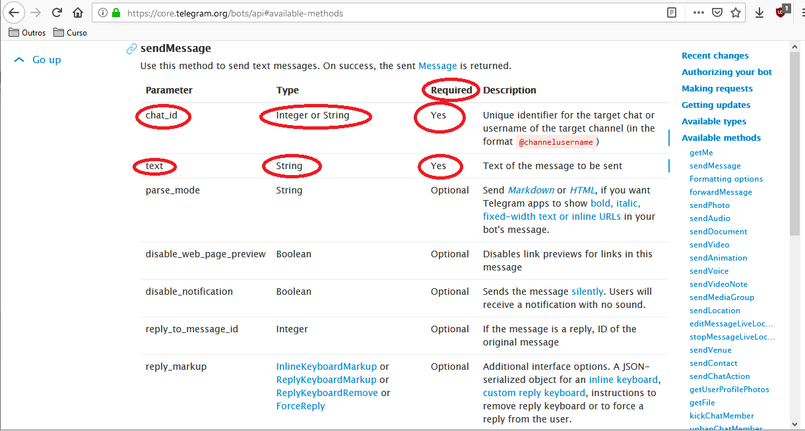
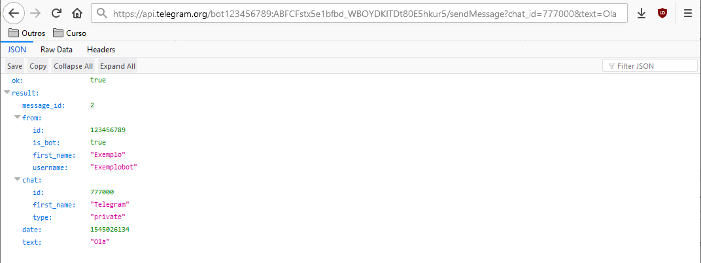
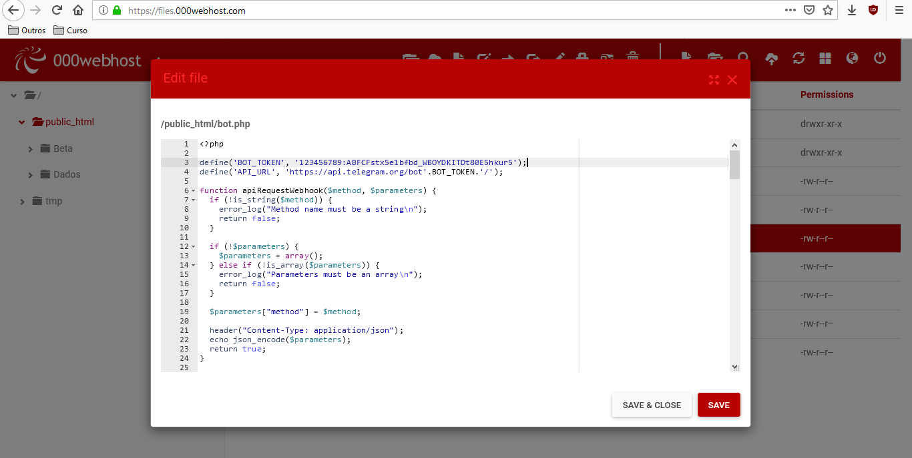
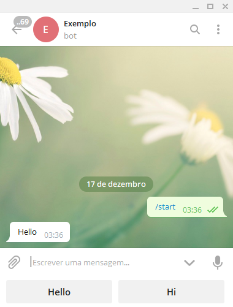

# SE APROFUNDANDO MAIS:
# 1. Como criar meu próprio Bot?
Antes de iniciar, a pergunta mais importante é: Você sabe alguma linguagem de programação?
Para criar um bot no Telegram você necessita criar um pequeno programa que interaja com os servidores do Telegram.
Se você não sabe alguma linguagem de programação, existem algumas outras alternativas como o "Manybot" que não necessita de habilidades em programação. Nesse artigo não buscaremos tratar da criação de bots no Manybot.

## 1.1 Manybot (etc.)
Esses serviços lhe permitem usar os servidores deles para criar um bot no Telegram. Eles lhe disponibilizam o "esqueleto" e você pode fazer algumas pequenas modificações, a exemplo dos diálogos.
Importante: Usando o Manybot, você apenas pode fazer aquilo que o Manybot lhe permite fazer. Ou seja, você possui várias limitações. Mas você não precisa se preocupar com programação nem com a manutenção de servidores para o bot.

## 1.2 Contratando um desenvolvedor
Caso você precise de um bot e não tenha tempo para aprender a programar, a melhor opção é contratar um desenvolvedor que faça o bot para você.
[Clique aqui para ver uma lista de desenvolvedores de bots para Telegram.](https://t.me/ListaDevs)

## 1.3 Programando você mesmo
Programar você mesmo o bot lhe permite fazer o que quiser sem qualquer limitação. Você pode fazer de tudo o que seja possível através da bot API. Por exemplo: Você pode criar um bot que está conectado ao sistema de automação da sua casa que poderá ligar e desligar as luzes da casa enviando uma simples mensagem no Telegram. PORÉM: se optar por programar o bot você mesmo, você precisará antes pensar o que irá usar como servidor para o bot (mais informações sobre isso depois). Se você não sabe programar e não pretende aprender como programar, a melhor opção é parar de ler por aqui e usar o "Manybot" ou pagar um programador para criar um bot. Ok, já que você continuou a ler, acredito que você saiba pelo menos uma linguagem de programação (ou pelo menos está disposto a aprender uma). Saiba que Inglês é a principal linguagem do mundo. A maioria do material para estudo para QUALQUER assunto está em inglês. Antes de qualquer coisa, você precisa conseguir ler em inglês, tanto para a programação, quanto para qualquer coisa que fará daqui em diante na vida! Sabendo isso, vamos iniciar com os detalhes.

# 2. Como eu inicio?
## 2.1 Servidores
Vamos iniciar do começo. Para evitar problemas no futuro, você deve começar a pensar AGORA o que irá usar como servidor para seu bot. Um bot é um código que interagem com um servidor (do Telegram) através de uma API. Ou seja, se você quer um bot funcionando 24 horas por dia, 7 dias por semana, você precisará antes de um servidor funcionando 24 horas por dia, 7 dias por semana (obviamente). Abaixo listei algumas coisas que você poderá usar como servidor para seu bot:
* 🔰Microcomputador ou Raspberry Pi
* 🔰Ter um computador ligado 24 horas
* 🔰Pagar por uma VPS para alguma empresa de servidores
* 🔰Usar um servidor compartilhado (shared hosting).

As vantagens e desvantagem são claras: usar um Raspberry Pi consome muito menos energia que um computador e custa muito mais barato. Usando uma VPS você terá muito mais poder de processamento e não precisará se preocupar com a energia ou internet da sua casa, mas precisará pagar a VPS mensalmente.
Abaixo colocarei algumas informações sobre servidores disponíveis e seus custos:

## Nuvem:
Servidores escaláveis com alto poder de processamento. Isto é, você pode aumentar o poder de processamento conforme o tráfego do programa/bot vá aumentando.
* Prós: Alto poder de processamento. Várias opções. Algumas opções são muito fáceis de usar. Em alguns você só paga pelo minuto que usa.
* 🔰Contras: Pode ser bem caro
* 🔰Amazon Web Services (Gratuito no 1º ano)
* 🔰Google Cloud (Gratuito no 1º ano)
* 🔰Microsoft Azure
* 🔰Google App Engine 
* 🔰How to create a Bot on Google App Engine
* 🔰Google Cloud Functions 
* 🔰Building a serverless Telegram bot)
* 🔰Heroku (possui plano gratuito)
* 🔰Heroku getting started with Python
* 🔰Webhooks on Heroku
* 🔰Skeleton repository
* 🔰Firebase (possui plano gratuito)
* 🔰Openshift (possui plano gratuito)
* 🔰How to run a Bot on Openshift v2
* 🔰How to run a Bot on Openshift v3
* 🔰PythonAnywhere (possui plano gratuito para Python)
* 🔰Glitch (gratuito para Node.js)
* 🔰Buddy.works (possui plano gratuito)
* 🔰GearHost (possui plano gratuito para PHP e .NET)

## VPS (Melhor opção para grandes bots):
O "Virtual Private Server" funciona como um computador virtual ligado 24 horas por dia.
* Pros: Pagamento mensal fixo. Praticamente um computador rodando na nuvem.
* Contras: Um pouco complicado para configurar o servidor.
* 🔰DigitalOcean
* 🔰Linode
* 🔰RamNode
* 🔰Scaleway (Possui o servidor em Amsterdã mais próximo da Bot API do Telegram)
* 🔰RunAbove
* 🔰Sabahost
* 🔰Netcup
* 🔰OVH

[Bônus! Você pode ver uma tabla com as VPSs de melhor CustoxBenefício clicando aqui.](https://docs.google.com/spreadsheets/d/1LFRZ2eAFZ53eobP8BF81j_1djKqQ-nRYmToeV0Ev2_k/edit#gid=0)

## Servidores WEB compartilhados (Shared hosts):
São sistemas que rodam PHP lhe permite criar sites na internet e podem também serem usados para criação de bots no Telegram.
* Prós: Vários são gratuitos. Muito fácil de serem usados. Você ainda poderá usar para criar sites facilmente. Melhor opção para pequenos bots em PHP.
* Contras: Funcionam APENAS para a linguagem de programação PHP. O poder de processamento é MUITO baixo, mesmo os bots mais simples podem não responder rapidamente. Vários dos servidores gratuitos não funcionam 24 horas por dia.
SharedHost Pagos:
* 🔰Hostinger Brasil (suporte em português)
* 🔰iPage
* 🔰BlueHost.com
* 🔰A2Hosting
* 🔰HostGator

## SharedHosts Gratuitos:
* 🔰AlterVista.org (melhor opção dentre os gratuitos)
* 🔰000webhost.com (Mais fácil de ser usado. Online apenas 23 horas por dia)
* 🔰1FreeHosting.com
* 🔰FreeHosting.io
* 🔰x10Hosting.com
* 🔰100webspace.com

## IDEs na Web:
Funcionam apenas quando o navegador está aberto, após você fechar o navegador, o código continua salvo, mas o bot para de funcionar.
* Prós: Excelentes para aprender a programar e para testar o código.
* Contras: Versões gratuitas só funcionam quando o navegador está acessando o site.
* 🔰Codenvy
* 🔰How to create a Bot on Codenvy
* 🔰Koding
* 🔰Cloud9

## Tunnels:
Programas que lhe permitem receber requisições webhook do Telegram diretamente no seu computador sem precisar se preocupar com coisas como Firewall, DNS ou Domínio.
* Prós: O poder de processamento é o do seu computador. Possui planos gratuitos.
* Contras: Seu computador precisa estar ligado para receber as requisições. Usar o sistema de longpooling do Telegram lhe permite fazer bots sem se preocupar com esses sistemas de tunelamento.
* 🔰localtunnel (gratuito)
* 🔰ngrok (possui plano gratuito)

## Microcomputadores:
Microcomputadores (também chamados de MiniPC) são muito baratos e possuem baixíssimo gasto de energia.
* Prós: Você só paga para comprar o Microcomputador. Dá pra colocar uns controles de Videogame e ir jogar nele xD 
* Contras: A latência (ping) da internet em sua casa pode não ser tão rápida. Caso a energia da sua casa caia, o Microcomputador desliga.
* 🔰RaspberryPi
* 🔰BananaPi
* 🔰Comprar MiniPC
* 🔰Importar MiniPC

## 2.2 Linguagem de Programação
Se você já sabe alguma linguagem de programação, pode ir direto e usá-la. Se você ainda não sabe nenhuma linguagem ou pretende usar alguma outra que se encaixe melhor no bot, dê uma olhada nas sugestões de linguagens para programação de bots.
* 🔰PHP
* 🔰Python
* 🔰Node.js
* A maioria dos bots que vi no Telegram são programados em Python, por isso há inúmeras Libraries e Frameworks (mais explicações sobre isso depois) disponíveis. Python é fácil para se aprender e fácil para se programar. A comunidade de desenvolvedores em Python é gigantesca. Se você busca uma linguagem com muito suporte, esta é a ideal.

* PHP é talvez ainda mais fácil que Python! Porém, a leitura de códigos é um pouco mais complicada. PHP é uma linguagem voltada ao desenvolvimento de sites e por isso há vários sites oferecendo servidores rodando apenas PHP a preços baixíssimos e até gratuitos. Por ser voltada ao desenvolvimento de website, PHP é a melhor linguagem para desenvolver bots usando o sistema de webhook do Telegram. Se você busca uma linguagem fácil, com servidores baratos, e que também lhe permita desenvolver sites, esta é a ideal. O SoloLearn é um aplicativo excelente para se iniciar no PHP.

* Node.js (JavaScript) é sem dúvida a linguagem mais fácil de todas as que foram aqui listadas. Suas frameworks são as mais simples de serem usada. Porém, apesar de ser extremamente fácil, noto que poucos desenvolvedores acabam usando essa linguagem para desenvolvimento de bots no Telegram. Se você busca uma linguagem extremamente fácil, essa é a ideal.

# 3. Library, Framework ou nenhum dos dois?
A Bot API do Telegram usa um sistema baseado em requisições HTTP. Você acessa um URL e passa os parâmetros necessários. Após isso, o Telegram responde a sua requisição com uma resposta codificada em JSON. Você precisará de um codificador e decodificador de JSON e alguns códigos para lhe permitir fazer requisições usando HTTP. Isso pode ser um pouco desgastante... Porque não usar então uma Library ou uma Framework?

Primeiramente você deve diferenciar os dois termos. Library é um conjunto de códigos usados para uma tarefa ou para um grupo de tarefas. Ex. libraries para edição de imagens provavelmente contém funções como "redimensionar" ou "rotacionar", que você pode usar diretamente no seu código. Isto é, você não precisa criar um código que faça isso, já que alguém já criou um código para facilitar sua vida.

Já uma framework, é um pedaço de software que funciona como um esqueleto. Ele funciona de forma autônoma e faz coisas quando elas precisam ser feitas. Você só precisa adicionar código para que ele faça mais coisas. No Telegram por exemplo, seriam códigos para responder certos comandos.

Se compararmos os dois no desenvolvimento de bots para o Telegram, notamos que frameworks são excelentes, já que elas já cuidam da parte do envio e recebimento de mensagens e as vezes até impedem do bot atingir dos limites da bot API. Você precisa se preocupar apenas com o código que será executado quando alguém enviar um comando para o bot. Usando uma library, você deveria periodicamente verificar se o bot recebeu alguma mensagem nova e cuidar das conversas você mesmo. A framework já faz isso para você. Tanto frameworks quanto libraries possuem métodos como 'send_message()' para enviar mensagens aos usuários. Você não precisa nem entender como eles funcionam. Eles apenas funcionam.

Frameworks são altamente recomendadas no desenvolvimento inicial de bots para o Telegram. No próprio site do Telegram você pode encontrar algumas libraries, frameworks e exemplos de bots.

# 4. Entendendo os HTTP Requests:
## 4.1 Requisições HTTP de uma maneira geral:
A bot API do Telegram se comunica através de Requisições HTTP. HTTP é um protocolo de comunicação baseado em TCP/IP usado para enviar dados (arquivos HTML, imagens, texto, vídeos, etc...) na internet. Há várias formas de enviar informações usando Requisições HTTP, porém aqui trataremos apenas das requisições GET e POST, que são as suportadas pela Bot API. De uma maneira geral, GET é usada para receber informações através de uma url enquanto POST é usado para enviar informações.

Requisições GET são as mais fáceis de compreender. "Acessar um site" é realizar uma requisição GET. A barra do seu navegador nada mais é do que um sistema para realizar Requisições HTTP GET. Toda vez que você digita na barra de endereço do navegador "google.com" e aperta Enter, você está enviando uma Requisição GET para o servidor do Google e recebendo a página inicial do Google como resposta. Toda Requisição GET pode ser transformada em um Link clicável.

* Por exemplo, quando acessamos o site https://telegram.org/index.php?dado=informação&dado2=1234 o seu navegador faz uma requisição GET com os seguintes atributos:

* https:// => fazer uma requisição segura com criptografia SSL
* telegram.org => requisição será enviada ao servidor do Telegram
* /index.php => o arquivo requisitado será o "index.php"
* ? => alguns dados a mais serão enviados
* dado=informação => A variável "dado" vale "informação"
* & => Uma nova informação será enviada
* dado2=1234 => A variável "dado2" vale "1234"
* Ao receber essa Requisição HTTP GET o servidor do Telegram processa o arquivo index.php e envia uma resposta em HTML para seu navegador (que é aquela página bonitinha do Telegram).

* Já as requisições POST são mais seguras e não podem ser transformadas em links. Elas são realizadas em segundo plano pelo seu navegador e permitem enviar muito mais informações do que seria possível através de Requisições GET.

## 4.2 Requisições HTTP para a Bot API
Show! Agora que você já tem uma ideia de como funcionam as Requisições HTTP, realizaremos Requisições GET para a Bot API!
Primeiro dê uma lida geral na Documentação da Bot API
Agora vamos criar um Bot usando o BotFather e salvar o Token.
O token do nosso bot de exemplo é:
123456789:ABFCFstx5e1bfbd_WBOYDKITDt80E5hkur5

* Conforme lemos no https://core.telegram.org/bots/api, que é a documentação da Bot API. Há vários métodos. Um dos mais simples é o método getMe que retorna informações sobre o bot. Então vamos acessar no nosso navegador a URL: https://api.telegram.org/bot123456789:ABFCFstx5e1bfbd_WBOYDKITDt80E5hkur5/getMe  
  

* Acabamos de enviar uma requisição GET para a Bot API requisitando informações sobre o bot que acabamos de criar. A Bot API respondeu em formato JSON que nosso bot possui ID de número 123456789 e é um bot de nome "Exemplo" e usuário "Exemplobot".

* Agora tentaremos enviar uma mensagem para o usuário com ID de número 777000 dizendo "Ola" (seria bom que você tentasse isso com seu próprio ID).  
  

* Conforme vimos na documentação, o método sendMessage tem como parâmetros obrigatórios "chat_id" e "text". Então acessaremos o seguinte link:
* https://api.telegram.org/bot123456789:ABFCFstx5e1bfbd_WBOYDKITDt80E5hkur5/sendMessage?chat_id=777000&text=Ola
* Especificamos que o bot que criamos deve enviar uma mensagem escrita "Ola" para o chat com o usuário de ID "777000". Tivemos sucesso e a Bot API retornou a seguinte resposta:  
  

* Especificamos que o bot que criamos deve enviar uma mensagem escrita "Ola" para o chat com o usuário de ID "777000". Recebemos informações sobre quem enviou a mensagem (o bot), o chat para qual foi enviado a mensagem, e informações sobre a própria mensagem enviada em si (id da mensagem, data de envio e texto).

# 5. Vamos programar em Python!
Aqui não tentaremos lhe ensinar como programar. Apenas lhe daremos uma breve introdução de como iniciar a programação de um bot usando Python.
* Nesse exemplo, usarei a linguagem de programação Python e a framework python-telegram-bot. Instale a framework conforme as instruções do guia de instalação. Crie um novo projeto com um arquivo chamado main.py. Você precisa importar algumas classes da framework, criar uma instância do "Updater" e criar uma função para ser executada toda vez que um usuário escrever algo. No final ele deve parecer algo assim. Quando você conseguir com sucesso usar o código acima, tente algo um pouco mais complicado.

* Agora que você tem seu primeiro bot em Python rodando, você pode tentar ampliá-lo. Adicione mais comandos, respostas personalizadas, etc. Uma boa ideia é dar uma olhada nesses exemplos para aprender mais sobre essa framework. É importante que você leia a documentação da framework e a documentação da Bot API do Telegram. Saber os comandos e parâmetros lhe ajudará muito no futuro.

# 6. Vamos programar em PHP!
Aqui não tentaremos lhe ensinar como programar em PHP. Apenas lhe daremos uma breve introdução sobre como iniciar a programação de um bot usando PHP em um Shared Host.

* Primeiro crie um bot usando o BotFather e anote o token que ele lhe enviar. O token que vamos usar nesse exemplo é: "123456789:ABFCFstx5e1bfbd_WBOYDKITDt80E5hkur5". Obviamente você não pode usar esse token, você deverá usar o token que lhe foi enviado pelo BotFather.

* Nesse exemplo usaremos o servidor gratuito para testes 000webhost. Crie sua conta no site (escolha um nome para seu site), faça login e clique em "File manager" para iniciar o envio de arquivos.
* Agora vamos criar um arquivo chamado bot.php. E nele colocaremos esse código com nosso próprio token. Ficará dessa forma:  
  

* Obviamente o arquivo possui mais de 160 linhas. Apertaremos "Salvar" e pronto, temos o arquivo salvo no servidor. Para que o arquivo seja executado todas as vezes que o bot receber alguma mensagem, temos que conectar o sistema de Webhook do Telegram com o nosso servidor. No nosso exemplo o nome do site é "telegrambot", o domínio do site é "telegrambot.000webhostapp.com" e o arquivo é "bot.php". Dessa forma, para acessar o site do arquivo pela internet, usamos o link "telegrambot.000webhostapp.com/bot.php". Para configurar o Webhook apenas colocaremos no navegador o link:

* https://api.telegram.org/bot123456789:ABFCFstx5e1bfbd_WBOYDKITDt80E5hkur5/setWebhook?url=https://telegrambot.000webhostapp.com/bot.php

* Nesse caso, "123456789:ABFCFstx5e1bfbd_WBOYDKITDt80E5hkur5" seria o Token do seu bot.

* Pronto! Se tudo der certo, receberemos uma mensagem de confirmação informando que o Webhook foi configurado corretamente. Se enviarmos "/start" para o bot ele nos responderá da seguinte forma:  
  

* Show! Agora você tem seu primeiro bot em PHP funcionando perfeitamente! Agora tente dar uma olhada no código e entender o que cada comando significa, bem como tentar desenvolver seus próprios comandos! É de extrema importância que você leia a documentação da Bot API do Telegram para entender como funcionam cada um dos métodos, bem como o funcionamento da API como um todo.

# 7. Frameworks / SDK / Wrapper para Telegram:
## 7.1 Python:
* 🔰python-telegram-bot
* 🔰pyTelegramBotAPI
* 🔰Telepot
* 🔰Telethon *MTProto Lib
* 🔰Pyrogram *MTProto Lib
* 🔰AIOGram

## 7.2 PHP
* 🔰PHP Telegram Bot
* 🔰TuriBot
* 🔰TelegramBotApiBundle
* 🔰Telegram Bot Api Base
* 🔰MadelineProto *MTProto Lib
* 🔰Telegram Bot PHP SDK
* 🔰Telegram Cli Client
* 🔰PHP TdLib *MTProto Lib

## 7.3 Node.js:
* 🔰Botgram
* 🔰Node.js Telegram Bot API
* 🔰Telegraf
* 🔰Telebot
* 🔰tgapi
* 🔰telegram-bot-api
* 🔰Slimbot
 
## 7.4 Outras linguagens:
* 🔰telegram-bot-ruby - Ruby
* 🔰telegram-bot-swift - Swift
* 🔰Jack Telegram Bot - MoonScript
* 🔰Margelet - Go
* 🔰go-telegram-bot-api
* 🔰Otouto - Lua
* 🔰Telegram Bot Bash - Bash
* 🔰Telegram Bot Java Library - Java
* 🔰haskell-telegram-api - Haskell
* 🔰telegram-bot-lua - Lua
* 🔰TarnaBot - C++

# 8. Projetos desenvolvidos pela comunidade:
## 8.1 Python:
* Currencies Robot (GitHub) - Membro(s): Khaled - Um Telegram Bot desenvolvido para visualizar a cotação de moedas e altcoins de forma rápida e fácil.
* ImageVisionBot (GitHub) - Membro(s): Pedro Guimarães - Um Telegram bot que usa visão computacional para descrever imagens.
* Myinstantsbot (@Myinstantsbot) (GitHub) - Membro(s): Heylouiz - Um Telegram Bot que busca sons no Myintants e os manda como mensagens de voz.
* Nathy BOT (GitHub) - Membro(s): Vycktor Stark - Bot com AIML + Telepot.
* Robô Db vs 1.0 (GitHub) - Membro(s): Vycktor Stark Adilson Cavalcante - Um Telegram Bot simples que executa até no Qpython.
* Robô Db vs 3.0 (GitHub) - Membro(s): Vycktor Stark - Bot baseado nas antigas versões do Robô Db.
* SiDBot (@sidbot) (GitHub) - Membro(s): TiagoDanin - Um bot baseado nas antigas versões do SiD, agora feito do zero e escrito em Python.
* Timmoty (GitHub) - Membro(s): Francis Taylor - Bot para Telegram feito com Threads nativa da linguagem Python.
* RastreioBot (@RastreioBot) (GitHub) - Membro: GabrielRF - Bot para rastreamento de pacotes cadastrados no sistema dos Correios.
* Send2KindleBot (@Send2KindleBot) (GitHub) - Membro: GabrielRF - Bot para envio de documentos para Kindle.

## 8.2 PHP:
* Bot Packagist (GitHub) - Membro(s): VitorMattos - Um Telegram Bot para pesquisar em packagist.org
* SendCH-Telegram (GitHub) - Membro(s): TiagoDanin - Um webapp para enviar mensagem com suporte a Markdown no Telegram.

## 8.3 Lua:
* Robô Db vs 2.0 (GitHub) - Membro(s): Vycktor Stark Adilson Cavalcante Wesley Henrique - Um Telegram Bot baseado no projeto da equipe Synko Developers, e no projeto do SiD feito pelo TiagoDanin.
* SiD (GitHub) - Membro(s): TiagoDanin - Um bot baseado no Otouto com suporte a Inline.
* SpotifyTelegram (GitHub) - Membro(s): TiagoDanin - Uma coleção de plugins para busca no Spotify.

## 8.4 Projetos de código fechado:
* RobôED (@EdRobot) - Equipe: Synko Developers - Fui criado pra tornar seu grupo mais divertido e organizado.
* Shiiinabot (@shiiinabot) - Membro: Gabriel - Bot para deletar qualquer tipo de mensagem em grupos. Também pode-se deletar mensagens usando Regex.
* Easy Currency (@easy_currency_bot) - Membro: Thomas Groch - É uma ferramenta rápida para obter a taxa de câmbio e conversão de moedas em tempo real, com suporte para Reais, Dólares e Bitcoins. (Bot offline)
* imguradbot (@imguradbot) - Membro: Juliano Dorneles - Um bot para baixar imagens de álbuns do Imgur.
* ts2chbot (@ts2chbot) - Membro: Juliano Dorneles - Um bot para conversão de vídeos comuns para Telescopes (é possível enviar vídeos diretamente ou postar links do Instagram e Youtube - sempre observando o limite máximo de upload para Telescopes, que gira em torno dos 9Mb, independente da duração).

# 9. Ainda tem dúvidas?
* Está em dúvida em qual VPS escolher? Dê uma olhada aqui.

* Qualquer dúvida que tiver, pode perguntar lá no [Grupo de SABER](https://t.me/GRUPOCN/3013). É um grupo feito por vários desenvolvedores de bots, de aplicativos e web. Na maioria dos casos haverá alguém para te ajudar. Sinta-se livre para fazer qualquer pergunta relacionada a bots no Telegram por lá.
  
# 10. CRÉDITOS:
* [Artigo escrito em ingês por @d_Rickyy_b.](https://telegra.ph/Introduction-to-bot-programming-02-21)
* [Artigo escrito em Português por Desenvovedores de bots.](https://telegra.ph/Introdu%C3%A7%C3%A3o-a-programa%C3%A7%C3%A3o-de-bots-no-Telegram-12-16)
* [Documentação feita com apoio dos ADMs do Canal de Códigos.](https://t.me/CODIGOCN)
